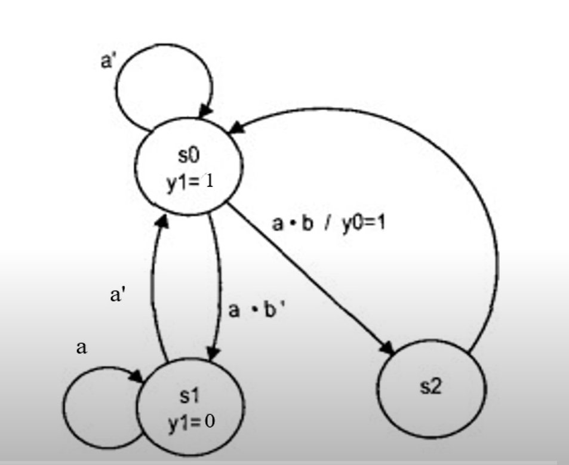

# Mealy Machine

## là 1 mạch tuần tự đồng bộ với từng khối

1. Khối hiện tại - State register

- đảm bảo công việc đồng bộ trong hệ thống => Có Clk thì thực hiện, không có Clk thì không thực hiện

- Tạo tính đồng bộ và điều đặn trong công việc

2. Khối kế tiếp - Next state logic

- dự đoán trạng thái kế tiếp, cái quy luật của hệ thống là gì, còn gọi là logic của hệ thống

3. Khối ngõ ra - Output logic

- khối quản lý ngõ ra, tức mình sẽ làm gì với ngõ ra

- Thường dùng để hiện thị led, hoặc các phép so sánh để thực hiện tiếp 1 công việc nào đó.

## Ngõ ra của máy Mealy

- phụ thuộc vào khối trạng thái hiện tại và tín hiệu input ngay tại thời điểm đó, đi qua khối ngõ ra để xuất tín hiệu ngõ ra

## để phân biệt sơ đồ trạng thái là Mealy Machine

- nhìn vào từng node(ô) trong sơ đồ trạng thái chỉ có tên của node đó chứ không có trạng thái trong node, giá trị ngõ ra nằm trên đường đi và trên đường đi có 2 số.

## Ví dụ

Viết chương trình cho các máy trạng thái sau:

/* Chú ý đây là bài tập khó: Kết hợp vừa máy Moore vừa máy Mealy

### Phân tích máy Moore và Mealy

Xác định xem máy có mấy ngõ vào và mấy ngõ ra để khai báo module

Xác định nhánh nào máy Moore, nhánh nào Mealy

Xác định Reset tích cực mức 0/1. VD Reset = 0 : tích cực mức 0

Phải đặt địa chỉ cho từng node trong sơ đồ trạng thái vì mỗi node chưa xác định được là gì. VD

- A : 00

- B : 01

- C : 01

Phải quan tâm trong sơ đồ máy trạng thái ngõ ra khi nào là mức 1.

    Đối với Moore, ngõ ra = 1 khi ở trạng thái hiện tại nào (node nào).

    Đối với Mealy, ngõ ra = 1 khi ở trạng thái ngõ ra hiện tại nào (node nào) và tín hiệu trên đường đi lúc đó

Xác định node xuất phát đầu tiên trong sơ đồ

Các giá trị nằm trên đường đi từ node này sang node khác là các giá trị ngõ vào để làm thay đổi các trạng thái của máy. Máy chuyển từ node này sang node khác

Các trạng thái tại các node đang xét là trạng thái hiện tại

Các trạng thái tại các node tiếp theo mà có khả năng node đang xét có thể chuyển sang thì là trạng thái kế tiếp

Đối với máy Moore, tại từng node phải quan tâm ngõ ra (thường nằm trong node đó) bằng bao nhiêu để xuất ra

Đối với máy Mealy, phải quan tâm tín hiệu trên đườn đi và ngõ ra sẽ nằm trên đường đi chứ không nằm trong node. Ngõ ra sẽ phụ tuộc vào trạng thái hiện tại và tín hiệu ở trên đường đi
