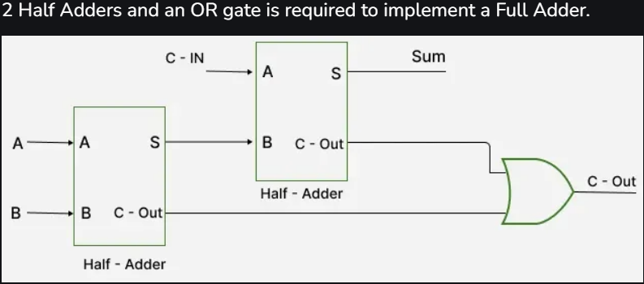
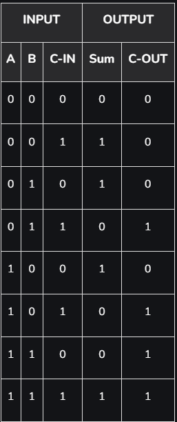
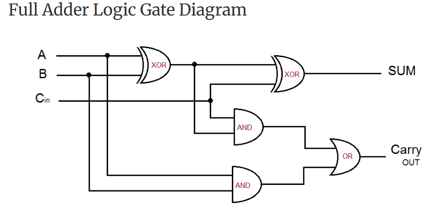

# Full_Adder

## 1. Bộ cộng toàn phần

Được tạo thành từ 2 bộ HalfAdder

Sơ đồ khối và bảng trạng thái

* Hoàn thành

## 2. Bộ cộng toàn phần

Được tạo ra từ các cổng or, and và xor

Sơ đồ khối và bảng trạng thái

* Tương lai sẽ code
