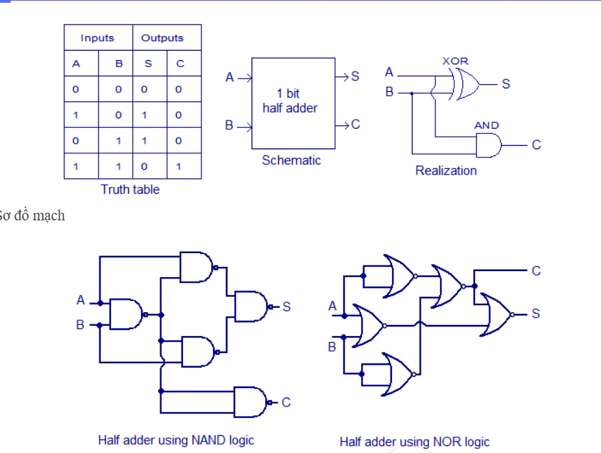

# Half_Adder

Sơ đồ khối và bảng trạng thái



## Viết testbench

1. Cần `timescale 1ns/1ps

2. Khai báo module `<nameModuleTB>;`

3. Khởi tạo các biến input/output
    1. input thì có kiểu reg
    2. output thì có kiểu wire

4. Gọi module cần test bằng uut và truyền tham số tương ứng

    ``` text
    <nameModuleTest> uut (
        // .parameter(parameter)
    );
    ```

5. Xác định là mạch tổ hợp hay mạch tuần tự
    1. Nếu là mạch tổ hợp thì không cần sinh xung clock trong khối always
    2. Nếu là mạch tuần tự cần sinh xung clock trong khối always

6. Sinh các test case trong khối initial

7. Kết thúc bằng #time $finish;

8. Có thể viết task để kiểm tra tự động. Có thể dùng các $display, $monitor,...

    -> chỉ cần nhìn qua console log, không cần soi waveform nhưng gây nặng file
