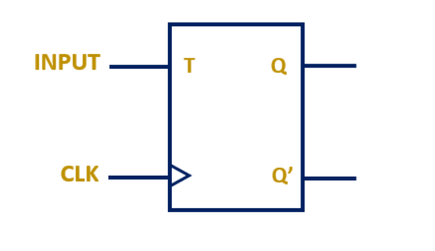
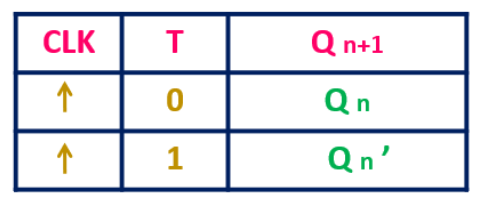

# Kiến thức quan trọng cần nắm rõ trước khi bắt đầu viết chương trình

Module và bảng trạng thái T FlipFlop

## 1. Mạch tổ hợp (Combinational Circuit)

Định nghĩa:
Ngõ ra chỉ phụ thuộc vào ngõ vào hiện tại, không có phần tử nhớ.

Không có clock.

Hoạt động tức thời (giới hạn bởi độ trễ cổng logic).

Ví dụ:

Cổng logic: AND, OR, NOT, XOR …

Bộ cộng (Adder), bộ giải mã (Decoder), bộ chọn (MUX).

## 2. Mạch tuần tự (Sequential Circuit)

Định nghĩa:
Ngõ ra phụ thuộc cả ngõ vào hiện tại và trạng thái trước đó.

Có phần tử nhớ (flip-flop, latch).

Luôn cần xung clock (đồng bộ) hoặc tín hiệu kích hoạt (asynchronous latch).

Ví dụ:

Flip-Flop D, T, JK …

Thanh ghi (Register), Bộ đếm (Counter), FSM (Finite State Machine).

## 3. wire

Dùng để kết nối (giống dây trong mạch điện).

Không lưu giữ giá trị → chỉ phản ánh ngay lập tức giá trị từ nguồn kết nối.

Thường dùng cho:

Ngõ vào (input) của module (mặc định là wire).

Ngõ ra (output) nếu được gán bằng assign (liên tục).

Các kết nối giữa các module, hoặc các tín hiệu tổ hợp đơn giản.

## 4. reg

Dùng để lưu trữ giá trị (giống 1 ô nhớ / flip-flop).

Có thể được gán giá trị bên trong always block hoặc initial block.

Thường dùng cho:

Ngõ ra (output) của module nếu nó thay đổi giá trị theo clock hoặc theo logic trong always.

Các biến trung gian cần nhớ giá trị qua nhiều chu kỳ clock.

## 5. = → blocking assignment

Nghĩa là gán chặn (blocking).

Lệnh gán sẽ được thực hiện ngay lập tức và chặn các lệnh phía sau trong cùng khối always.

Thích hợp cho:

    Mô tả logic tổ hợp (always @(*))

    Mã trung gian trong tính toán

Ví dụ:

    always @(*) begin
        a = b;       // gán a = b ngay lập tức. Giống như ++a
        c = a & d;   // c dùng giá trị mới của a
    end

Ở đây c sẽ = (b & d) vì a được cập nhật ngay.

## 6. <= → non-blocking assignment

Nghĩa là gán không chặn (non-blocking).

Lệnh gán sẽ xếp hàng và chỉ cập nhật giá trị khi kết thúc vòng lặp thời gian (sau tất cả lệnh trong always).

Thích hợp cho:

    Mạch tuần tự (triggered bởi clock, always @(posedge clk))

    Tránh race condition khi nhiều FF cập nhật cùng lúc

Ví dụ:

    always @(posedge clk) begin
        a <= b;       // gán a = b (nhưng cập nhật sau khi always kết thúc). Giống như a++
        c <= a & d;   // c vẫn dùng giá trị cũ của a
    end

## 7. So sánh trực tiếp

| Đặc điểm           | = (blocking)         | <= (non-blocking)      |
|--------------------|---------------------|------------------------|
| Thực hiện          | Ngay lập tức         | Sau khi always kết thúc|
| Dùng cho           | Logic tổ hợp         | Logic tuần tự (clock)  |
| Ứng dụng           | Tính toán trung gian | FF, latch              |
| Nguy cơ            | Dễ gây race condition| Ít lỗi hơn cho mạch đồng bộ |

## 8. Ví dụ minh họa quan trọng

Dùng = (blocking):

    always @(posedge clk) begin
        q1 <= d;
        q2 <= q1;
    end

Trong always @(posedge clk) (mạch tuần tự): dùng <=

Không nên trộn lẫn cả = và <= trong cùng một always block.

## 9. Đặc điểm của Testbench

Không có ngõ vào/ra (input/output): testbench chỉ là "mạch giả lập", không synthesize (không đưa lên FPGA).

Gồm các phần chính:

    Khai báo tín hiệu → dùng reg cho input (vì TB phải điều khiển giá trị), wire cho output.

    Gọi (instantiate) module cần test.

    Sinh xung clock (nếu cần).

    Sinh stimulus (tín hiệu đầu vào) → reset, dữ liệu, v.v…

    Quan sát kết quả → dùng $monitor, $display, $dumpfile, $dumpvars để ghi waveform (nếu cần).

## 10. Nguyên tắc "chuẩn chỉ" viết test bench

Đặt `timescale (1ns/1ps)`.

Đặt tên rõ ràng: `tb_<module_name>`.

DUT (Device Under Test) đặt trong uut (unit under test).

Stimulus viết trong initial (có reset, có test case rõ ràng).

Clock viết trong always (có period rõ ràng).

Kết quả ghi log bằng $monitor và lưu waveform (.vcd) (nếu cần).

Kết thúc mô phỏng bằng $finish (có thể có hoặc không).
